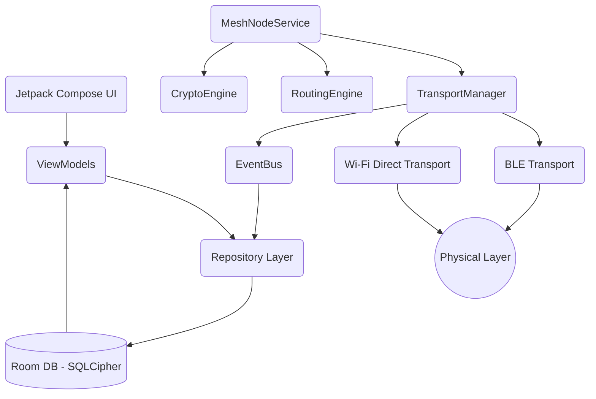

# Architecture

MeshNet employs a strict Unidirectional Data Flow (UDF) across isolated feature modules and a headless background runtime.

## Module Graph

## Layers

1. **Transport Layer (`core:mesh`)**: Abstracted interface `MeshTransport` handling raw byte transmission. Pluggable design (BLE, Wi-Fi Direct).
2. **Protocol & Routing (`core:protocol`, `core:routing`)**: Handles PRoPHET routing, capability negotiation, and packet serialization (Protobuf).
3. **Crypto Engine (`core:crypto`)**: Exposes Tink primitives and manages Double Ratchet sessions.
4. **Mesh Runtime (`core:mesh:MeshNodeService`)**: A Foreground Service keeping the node alive in Doze mode. Independent of the UI.
5. **Storage (`core:storage`)**: Encrypted-at-rest SQLite database (SQLCipher) mapping entities to domain models.
6. **UI (`feature:*`)**: Stateless Jetpack Compose UI reacting strictly to `StateFlow` updates from the Repositories.
