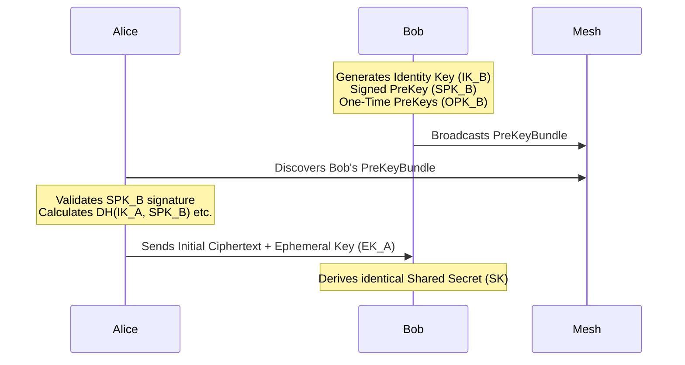

# Cryptography

MeshNet employs state-of-the-art cryptographic protocols to ensure confidentiality, integrity, and Forward Secrecy.

## 1. Handshake (X3DH)

MeshNet uses the Extended Triple Diffie-Hellman (X3DH) key agreement protocol to establish a shared secret between two peers, even if one is offline.

## 2. Session Encryption (Double Ratchet)

Once the shared secret is established, the Double Ratchet algorithm is initialized. Every message derives a unique, ephemeral message key.

- **Forward Secrecy**: Compromising a current key does not compromise past messages.
- **Break-in Recovery**: If a key is compromised, subsequent messages will self-heal the session once a new Diffie-Hellman ratchet step occurs.

## 3. Sender Keys (Group Chat)

To avoid the O(N) scaling issue of 1:1 encrypting group messages, MeshNet uses the Signal Sender Key protocol for N-way groups.
- Each member generates a `SenderKeyRecord`.
- The record is distributed 1:1 to all group members using their existing Double Ratchet sessions.
- Subsequent group messages are symmetrically encrypted with the Sender Key and broadcasted efficiently.
